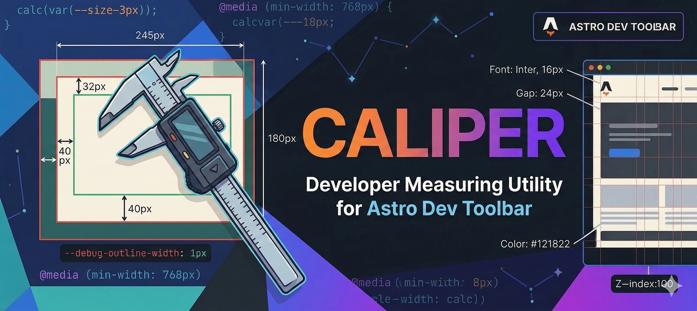
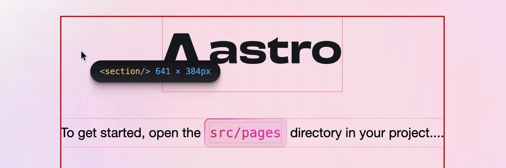
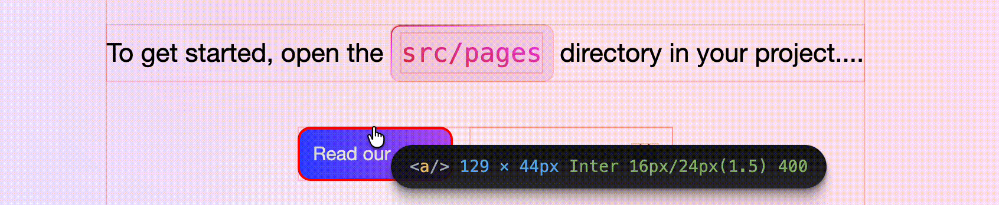
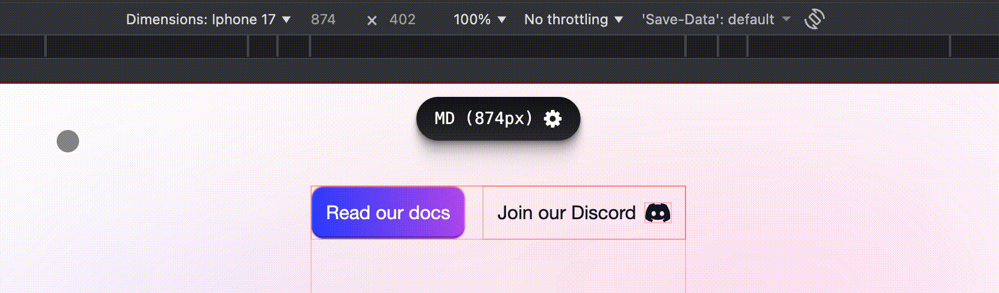

## Layout tool for Astro dev toolbar

**Caliper** is a precision layout tool for the Astro (v 5+) Dev Toolbar. Stop guessing margins and hunting through the "Elements" tab — measure, inspect and check alignment of your components with pixel perfection directly in the browser.

### 🚀 Quick Features

| Feature            | Action / Shortcut  | Description                                                             |
| :----------------- | :----------------- | :---------------------------------------------------------------------- |
| **🔍 Inspector**   | Hover Element      | View live dimensions, font families, and computed styles.               |
| **📏 Ruler**       | `Alt` / `⌥` + Drag | Measure pixel-perfect X & Y distances between any two points.           |
| **📱 Breakpoints** | Top Overlay        | Real-time indicator for active CSS breakpoints (SM, MD, LG, etc.).      |
| **⚓ Click Trap**  | Hold `P`           | Disable click events to prevent accidental navigation while inspecting. |
| **🎨 Outlines**    | Toggle Settings    | Visualizes element boundaries to debug layout shifts and alignment.     |
| **💾 Persistence** | Auto-save          | Remembers your "ON" state and settings across page refreshes.           |

### 🔍 Tooltip Inspector



Provides detailed information about element when you hover over it.

- Shows element tag name.
- Shows width and height of hovered element.
- Shows font family, size, line height, and font weight for elements with text content.
- Adds a red outline to all elements and stronger outline to element currently being inspected to reveal its boundaries.

Individual tooltip features can be turned on and off in **dedicated settings panel** activated through ⚙️ button located on the breakpoint indicator.

### 📏 Ruler



Hold `Alt / Option` key and drag to measure X & Y distance between elements.

### 📱 Breakpoint Indicator


Current breakpoint (SM, MD etc.) and screen width is shown at the top of the screen.

### ⚓ Click trap



Hold `P` to disable click events and prevent accidental navigation (ideal for dev tools mobile mode with Touch Emulation).

### 💾 Persisted ON state

Tool can persist its ON state (trough `localstorage`) between page reloads and navigation (can be turned off in settings).

## Installation & Integration

Install as a dev dependency

```bash
pnpm add -D ...
npm install --save-dev ...
```

Add Astro config integration:

```typescript
//astro.config.mjs
import caliper from "astro-caliper";

export default defineConfig({
  integrations: [caliper()],
});
```

## Usage

1.  Run your Astro dev server (`npm run dev`).
2.  Open the Astro Developer Toolbar (usually at the bottom of the screen).
3.  Click on the "Caliper" icon on the Astro dev toolbar in the bottom of the screen.
